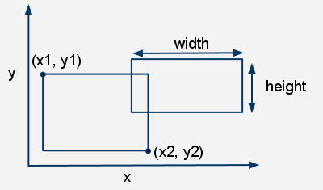

## rectangleIntersection

**Difficulty**: Medium

## Prompt 

Write a function called `rectangleIntersection` that accepts two objects as input. Each object contains information about a rectangle. More specifically each object looks like the one below: 

```js
let rectangle = {

    // coordinates of bottom-left corner
    leftX: 1,
    bottomY: 1,

    // width and height
    width: 6,
    height: 3,

};
```

Let me explain the above object: 

* `leftX` is the x-coordinate of the bottom-left point of the rectangle
* `bottomY` is the y-coordinate of the bottom-left point of the rectangle

The edges of our rectangle are parallel to one another.



`rectangleIntersection` should return the area in which the two rectangles overlap. If the two rectangles don't overlap it should return `false`.

## Examples

```js
let rectangle1 = {
    leftX: 1, 
    bottomY: 1, 
    width: 6,
    height: 6
};

let rectangle2 = {
    leftX: 2, 
    bottomY: 2, 
    width: 2,
    height: 2
};

let rectangle3 = {
    leftX: 4, 
    bottomY: 5, 
    width: 4,
    height: 3
};

expect(rectangleIntersection(rectangle1, rectangle2)).toBe(4);
expect(rectangleIntersection(rectangle2, rectangle1)).toBe(4);
expect(rectangleIntersection(rectangle1, rectangle3)).toBe(6);
expect(rectangleIntersection(rectangle3, rectangle1)).toBe(6);
expect(rectangleIntersection(rectangle2, rectangle3)).toBe(false);
expect(rectangleIntersection(rectangle3, rectangle2)).toBe(false);
```
